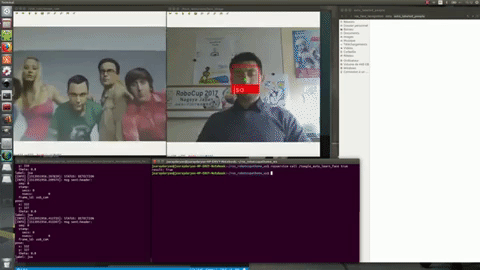

# 1. ros_face_recognition

## 2. Description
the project provide a ros node for people recognition (detection and learning) base on the dlib python package an especially on [the python face_recognition package] (https://pypi.python.org/pypi/face_recognition)

 

A complete video demonstration is available [here] (https://youtu.be/a1S2WkGmSc0)

## 3. Authors
* Jacques Saraydaryan

## 4.  Configuration 

2 launch files are available, both get the configuration from the common_face.yaml file:
```python
    #face_folder contains the initial labeled faces, these images are loaded at the node start
    face_folder: 'ros_face_recognition/data/labeled_people'
    
    #face_folder auto  contains the images learnt by the node when auto learn or lean service is activated
    face_folder_auto: 'ros_face_recognition/data/auto_labeled_people'
    
    # If you want to use gpu let user_cnn_module: True, this method is faster and more accurate
    user_cnn_module: True
    
    # Start the node in auto learn status, the node automatically learn and associated id to unknown faces
    continuous_learn: False
    
    # Start the node in face detection status, if false, no face is detected by the node
    activate_detection: True
    
    # indicate the number of second to learn face when using the LearnFace ros service
    learn_timeout: 20
    
    # define the topic of incoming images
    topic_img: '/usb_cam/image_raw'
    
    # define the topic of outgoing labeled images
    topic_face_img: '/face_detection/face_image'
    
    # define the topic of outgoing labeled boxes
    topic_face_box: '/robocup/get/entity2D_evidence'
    
    # True display labeled images
    publish_img: True
```

The face_identification_test_simple.launch file start a one thread face detection node

The face_identification_test.launch file start a multi threads face detection node (experimental)

By default launchers start node to visualize incoming images and outgoing images

## 5. Node
 ### 5.1  Subscribed Topics
  #### 5.1.1 topic_img ([sensor_msgs/Image](http://docs.ros.org/api/sensor_msgs/html/msg/Image.html))
   Incoming images for face detection and recognition
        
 ### 5.2 Published Topics
  #### 5.2.1 topic_face_img ([sensor_msgs/Image](http://docs.ros.org/api/sensor_msgs/html/msg/Image.html))
   Outgoing images with box and labels
  #### 5.2.2 topic_face_box ([robocup_msgs/Entity2D]())
   Outgoing face information including bounding box and labeled 
            
 ### 5.3 Services
  #### 5.3.1 learn_face ([ros_face_recognition/LearnFace](https://github.com/jacques-saraydaryan/ros_face_recognition/blob/master/srv/LearnFace.srv))
   Learn the largest unknown face with the given label, this operation wait learn_timeout second before ending
  #### 5.3.2 toogle_face_detection ([ros_face_recognition/ToogleFaceDetection](https://github.com/jacques-saraydaryan/ros_face_recognition/blob/master/srv/ToogleFaceDetection.srv))
   Enable or disable node image processing
  #### 5.3.3 toogle_auto_learn_face ([ros_face_recognition/ToogleAutoLearnFace](https://github.com/jacques-saraydaryan/ros_face_recognition/blob/master/srv/ToogleAutoLearnFace.srv))
   Enable or disable unknown face learning (auto generate uuid), learnt face will be stored into the face_folder_auto folder

### 5.4  Params
 #### 5.4.1 face_folder (string)
  face_folder contains the initial labeled faces, these images are loaded at the node start
 #### 5.4.2 face_folder_auto (string)
  face_folder auto  contains the images learnt by the node when auto learn or lean service is activated
 #### 5.4.3 user_cnn_module (bool, default: true) 
  If you want to use gpu let user_cnn_module: True, this method is faster and more accurate
 #### 5.4.4 continuous_learn (bool, default: false) 
  Start the node in auto learn status, the node automatically learn and associated id to unknown faces
 #### 5.4.5 activate_detection (bool, default: true) 
  Start the node in face detection status, if false, no face is detected by the node
 #### 5.4.6 learn_timeout (int, default: 20)
  indicate the number of seconds to learn face when using the LearnFace ros service
 #### 5.4.7 topic_img (string, default:/usb_cam/image_raw)
  define the topic of incoming images
 #### 5.4.8 topic_face_img (string, default:/face_detection/face_image)
  define the topic of outgoing labeled images
 #### 5.4.9 topic_face_box (string, default:/robocup/get/entity2D_evidence)
  define the topic of outgoing labeled boxes
 #### 5.4.10 publish_img (bool, default: false) 
  True display labeled images
  
  
## 6. How to test

Start the main node

```
roslaunch people_face_identification face_identification.launch
```

Call the Action Test node

```
rosrun people_face_identification LoadAndPublishImgTool.py 
```

